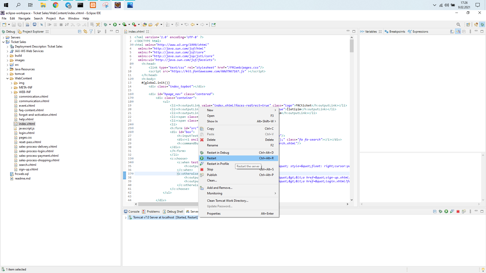

### Project Information
--- 
* Project Name:  
FRCweb
 

* Project Team:  
Fadıl Şahin 
Rahim Gökçeli 
Cem Gümüş
 

* Project Start Date:  
May 2020
 

* Project State And Duration:  
Done, 2 week
 

* Project Description:  
Application is a ticket sales web site for any type of events. People can search for events and buy tickets for events they want to join. In the application, all datas are connected with mysql database datas so all information is got from database. The app contains login system, communication page, search page, slider goes on. All design and implementation is done by the team members and any external codes are not used.
 
 

>:exclamation: --------------------------------------------------------------------------------- :exclamation:
>#### To Make The Application Work
>- ***Xammp need to be installed***
>- ***Eclipse need to be installed (2020-06 version is used at the explanation)***
>- ***Configurations need to be followed***
>
>:exclamation: --------------------------------------------------------------------------------- :exclamation:
### Configurations
---

### Xammp Control Panel

*Start Apache and Mysql.*

### Database

*Add a database named as frcweb.*
### Import SQL File

*Import given sql file in the project.*
### Open Project In Eclipse

*Open the project in eclipse as shown.*
### Add Server To The Project

*If there is not a tomcat server in the project add a new one as shown. You need to select tomcat server in the project folder.*

### Start And Run

*Do a right click to server and start it and select index.xhtml file in webcontent folder then run on server.*
### Be Careful 

*If 'restart' is written next to the server in brackets, you need to restart the server otherwise app doesn't work. After that you can run on server again.*
### Welcome To Website 

*It is ready to use.*
### Screenshots
---

### Part Of Index Page

### Search Page

### Part Of Event Page

### One Of Selling Pages

